  

  

  
  
  
  
  
  
  

## 🎀 About me

- 🎓 I'm a **first-year** student in the Data Science Bachelor's program at **Universidad Austral (Rosario)**.
- 💻 I'm learning Python, R, HTML, CSS, JavaScript, Git and GitHub, and I want to pick up more languages in the future.
- 🎶 I'm into music, art and dance, and I want to analyze them through data to understand everything that works behind the scenes.
- 🤝 I'm open to joining any project: each one gives me more knowledge and experience.
- 🐱 I love cats and the color pink.

🐾 Thanks for visiting my profile 🐾

