  

  
  
  
  
  

## About me

I'm a **first-year** student in the Data Science Bachelor's program at **Universidad Austral (Rosario)**.

I'm learning Python, R, HTML, CSS, JavaScript, Git and GitHub, and I want to pick up more languages in the future.

I'm into music, art and dance, and I want to analyze them through data to understand everything that works behind the scenes.

I'm open to joining any project: each one gives me more knowledge and experience. I also love cats and the color pink.

## Sobre mí

Estoy en **primer año** de la Licenciatura en Ciencia de Datos en la **Universidad Austral (Rosario)**.

Aprendo Python, R, HTML, CSS, JavaScript, Git y GitHub, y quiero sumar más lenguajes a futuro.

Me interesa la música, el arte y el baile, y quiero analizarlos desde los datos para entender cómo funciona todo lo que hay detrás.

Estoy abierta a participar en cualquier proyecto: cada uno me suma conocimiento y experiencia. Además, amo los gatos y el color rosa.

## Learning journey

| Area | What I'm exploring / Qué estoy explorando |
|------|-------------------------------------------|
| **Python** | Programming basics and data analysis / Bases de programación y análisis de datos |
| **R** | Statistics and data visualization / Estadística y visualización de datos |
| **HTML, CSS & JavaScript** | Building web pages / Armado de páginas web |
| **Git & GitHub** | Version control and collaboration / Control de versiones y colaboración |

## Goals

- Analyze music, art and dance with data. / Analizar música, arte y baile con datos.
- Build my first projects and share them here. / Hacer mis primeros proyectos y compartirlos acá.
- Collaborate with others and learn from them. / Colaborar con otras personas y aprender de ellas.
- Keep learning new languages and tools. / Seguir aprendiendo nuevos lenguajes y herramientas.

Thanks for visiting my profile. / Gracias por pasar por mi perfil.

